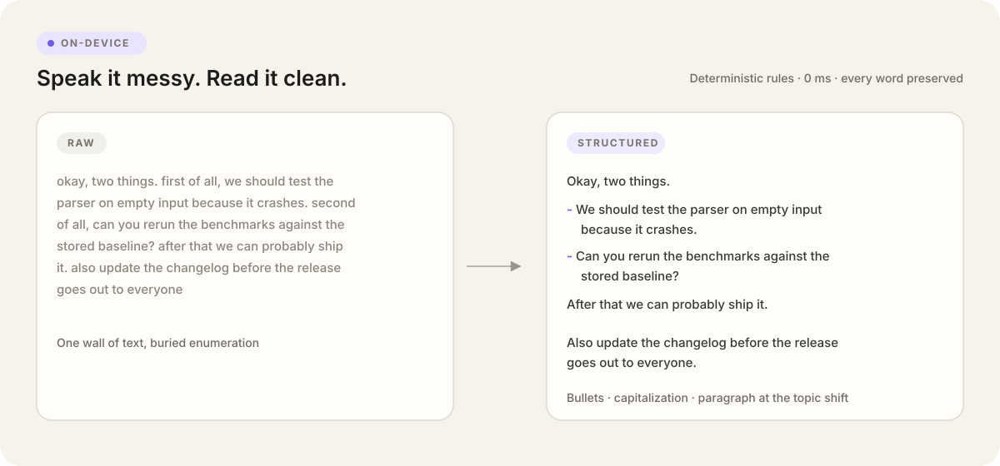

<p align="center">
  
</p>

<h1 align="center">Pressay</h1>

<p align="center">
  <strong>Quality-first voice dictation for AI prompts on macOS.</strong><br>
  Hold. Speak. Release. Your words appear at the cursor.
</p>

<p align="center">
  <a href="https://github.com/Zheruel/pressay-macos/actions/workflows/ci.yml"></a>
  
  
  <a href="LICENSE"></a>
</p>

Pressay is a native, hold-to-talk dictation app built for people who communicate with coding agents all day. Standard dictation records only while a shortcut is held, transcribes locally on Apple Silicon, cleans up predictable speech artifacts, and inserts the result into the field that was focused when recording began.

It is deliberately not an always-listening assistant. There is no account, telemetry, subscription, or cloud transcription.

> [!IMPORTANT]
> Pressay 1.4 targets Apple Silicon Macs running macOS 26 or newer. Shared builds are not notarized yet, so building from source is the most reliable installation path.

## Why Pressay

- **Quality first.** Fun-ASR MLT Nano is the calibrated English default; Whisper Large V3 Turbo covers 100 languages, and Voxtral Mini 3B is a slower option for people who want the most careful transcript. Each model offers only the languages it can actually decode.
- **Fast local inference.** `transcribe.cpp` runs GGUF models through ggml and Metal, with the model and Metal pipeline warmed before the first dictation.
- **Optional structure.** A Structured Dictation toggle adds punctuation, paragraphs, and bullet lists to longer dictations — deterministically, on-device.
- **Cursor-first UX.** A clipboard-preserving synthetic paste handles native, web, and Electron editors; direct Accessibility replacement is the fallback.
- **Learns your vocabulary.** A curated coding glossary, user rules, and local phonetic learning preserve repository names, products, acronyms, and casing.
- **Private by default.** Microphone audio never leaves the Mac. Standard dictation text stays local. No captured application context is retained.

## How it works

<p align="center">
  
</p>

| Shortcut | Default | Result | Network |
| --- | --- | --- | --- |
| Dictate | Right Option | Faithful transcript with deterministic cleanup | None after model download |
| Escape | Escape while recording | Cancels without inserting | None |

The hold key is configurable. Pressay captures the destination before its nonactivating overlay appears, so the result returns to the right app and selection.

## Structured Dictation

Longer dictations read better with sentences, paragraphs, and lists. The **Structured dictation** toggle in Settings applies a deterministic structuring pass after the normal cleanup:

<p align="center">
  
</p>

- Repairs missing terminal punctuation on near-punctuationless transcripts.
- Splits sentences with abbreviation and identifier guards (`e.g.`, `node.js`, `3.5` never split).
- Turns spoken enumerations ("first… second… finally…") into `-` bullet lists.
- Breaks paragraphs at discourse markers ("also", "by the way", "moving on") and caps paragraph length.

It never reorders, adds, or removes the words you spoke — the spoken ordinal markers of a list are the only thing it drops — and it never touches short dictations or terminal apps. Everything runs on-device with zero added latency; it is on by default and can be switched off in Settings.

## The configuration we ship

Pressay has one quality-first default instead of exposing a wall of decoder knobs:

| Layer | Shipping choice | Why |
| --- | --- | --- |
| Audio | Segmented `AVAudioEngine` capture, 16 kHz mono resampling, conservative edge trimming | Handles Bluetooth/device changes without clipping first or last words |
| ASR | Fun-ASR MLT Nano 2512 Q6_K GGUF via `transcribe.cpp` | Best English transcript on the development corpus: never collapsed a long dictation, resolved the most technical vocabulary, 2.5× faster than Whisper from a smaller artifact |
| Language | Per-model — only what the engine can decode | Fun-ASR runs English-locked, Voxtral offers eight plus detection, Whisper all 19; the picker follows the selected model |
| Cleanup | Deterministic text and vocabulary pipeline | Predictable, quick, and preserves protected tokens |
| Structure | Optional deterministic structuring pass | Readability without an LLM rewriting what was said |
| Multilingual option | Whisper Large V3 Turbo Q8 GGUF via `transcribe.cpp` | 100 languages, and the only engine that chunks long audio inside the runtime |
| Quality option | Voxtral Mini 3B Q4 GGUF via `transcribe.cpp` | Matches the default on technical vocabulary and punctuates more densely, at 9x the latency and 4x the size; eight languages plus detection |
| Long dictations | In-app splitting at a silence boundary | The context-bound engines cannot take a 100-second clip in one run; Pressay splits and keeps the chosen model instead of falling back to Whisper, which is the engine that collapses long clips |

### How the shipping models compare

Thirteen engines were replayed through the same 184-clip corpus. The two measurements that decided
the default:

<p align="center">
  
</p>

The three that ship:

| Engine | Download | Long-clip collapse | Technical terms | Median latency |
| --- | ---: | ---: | ---: | ---: |
| **Fun-ASR MLT Nano** (default) | 691 MB | **0/47** | **86%** | **0.14 s** |
| Whisper V3 Turbo | 886 MB | 3/47 | 75% | 0.39 s |
| Voxtral Mini 3B | 2.98 GB | **0/47** | 81% | 1.28 s |

"Collapse" counts dictations over 15 seconds that came back with no capitals and no punctuation —
the failure that motivated the 1.3 Voxtral option. Fun-ASR removes it outright while also being the
fastest and smallest engine measured. Thirteen engines were measured; the other ten are in the [benchmark notes](docs/benchmarks.md)
along with the method and what these numbers do not prove.

<p align="center">
  
</p>

### Why normal dictation does not use an LLM

We replayed 31 real dictations through four guarded on-device language-model prompt variants. Even the best variant changed a protected token on 2 of 31 clips. For standard dictation, that is the wrong failure mode.

<p align="center">
  
</p>

Pressay therefore keeps the whole dictation path deterministic — including the optional structuring pass, which only adds punctuation, paragraph breaks, and bullets. Read the [benchmark notes](docs/benchmarks.md) for the corpus, method, limitations, and sanitized data.

## Privacy model

| Data | Standard dictation | Optional Kimi features | Retention |
| --- | --- | --- | --- |
| Microphone audio | Processed locally | Never sent | 7 days by default |
| Transcript | Stored locally | Never sent | 30 days by default |
| Vocabulary candidates | Learned locally | Periodic review may send candidate terms and short transcript excerpts | Local learned rules follow history retention |
| Text around the cursor | Read transiently during Accessibility target capture | Never sent | Never stored |
| Telemetry or analytics | None | None | Never collected |

The first model download comes from Hugging Face. A Kimi API key is optional, stored in the macOS login keychain, and only enables the explicitly labeled cloud features. Pressay remains fully useful without it.

Pinned or corrected history records are retained until you delete them. Delete history from the full app window at any time.

## Install from source

### Requirements

- Apple Silicon Mac
- macOS 26+
- Xcode 26+ with the macOS 26 SDK
- Around 2 GB of free space for the default Fun-ASR model and build artifacts (Whisper V3 Turbo adds ~0.9 GB and Voxtral Mini ~3 GB if selected; only the selected model is downloaded, and artifacts from models Pressay no longer ships are removed automatically)

```bash
git clone https://github.com/Zheruel/pressay-macos.git
cd pressay-macos
make test
make app
open .build/Pressay.app
```

On first launch, the setup assistant requests:

1. Microphone access — record while a hold key is pressed.
2. Accessibility — insert the finished text into the focused field.
3. Input Monitoring — observe the global hold shortcut.

The first launch also downloads and warms the selected speech model. Later transcription is offline.

To install the current build in `/Applications`:

```bash
make install
```

To create a drag-to-install disk image:

```bash
make dmg
open .build/Pressay-*.dmg
```

### Signing without a paid Apple Developer account

The build script uses a compatible signing identity when one is present and otherwise applies an ad-hoc signature. Ad-hoc builds work for local development, but macOS may ask for permissions again after the app changes.

For stable permissions on one development Mac, create the local certificate once:

```bash
./scripts/create-local-signing-certificate.sh
make install
```

That certificate is trusted only on that Mac and cannot produce a notarized public release. Friends testing an ad-hoc build must explicitly approve it in Privacy & Security on first launch.

## Vocabulary

Pressay ships with a curated vocabulary for coding agents and team communication. It also learns phonetic corrections from recent dictations and applies them deterministically after ASR.

Add custom entries in **Settings → Dictionary**, one per line:

```text
WhisperKit <= whisper kit
Core ML <= core ml, core em el
myRepository <= my repository
```

The preferred spelling appears on the left; comma-separated forms on the right are corrected to it. Learned rules are visible and removable. Optional Kimi review only accepts corrections that map back to trusted vocabulary anchors.

## Project layout

```text
Sources/
├── PressayApp/             SwiftUI/AppKit app, permissions, audio, insertion
├── PressayCore/            Domain types, cleanup, vocabulary, retention
├── PressayTranscription/   transcribe.cpp-backed ASR
├── PressayPostProcessing/  Experimental on-device benchmark module
├── PressayBench/           Corpus replay and tuning CLI
└── TranscribeCpp/            Vendored Swift wrapper for the native runtime
Tests/PressayCoreTests/      Deterministic pipeline tests
Config/                       App metadata, icons, entitlements, and earcons
scripts/                      Build, install, signing, and DMG tooling
```

All modules and targets use the `Pressay` name. The bundle identifier and keychain service intentionally remain `dev.localflow.app` — they anchor macOS permission grants and stored data from earlier builds.

## Development

```bash
make build
make test
make app
```

CI runs the test suite and a full bundle build (assembly, ad-hoc signing, `codesign --verify`) on every pull request. Pushing a `vX.Y.Z` tag that matches the `Config/Info.plist` version triggers the release workflow, which publishes the DMG as a GitHub release.

`PressayBench` can replay a private calibration manifest without checking audio or transcripts into Git:

```bash
swift run PressayBench manifest-from-audio --manifest /path/to/manifest.json
swift run PressayBench asr --manifest /path/to/manifest.json
swift run PressayBench structure --manifest /path/to/manifest.json
swift run PressayBench tune-eval --timeline /path/to/timeline.json
```

Keep benchmark audio, transcripts, API keys, and generated results outside the repository. See [CONTRIBUTING.md](CONTRIBUTING.md) before opening a pull request.

## Known limitations

- macOS 26+ and Apple Silicon only.
- Meeting transcription, diarization, always-listening mode, mobile, Windows, and cloud ASR are out of scope.
- Insertion depends on Accessibility behavior in the target app. Pressay preserves the clipboard and falls back cleanly, but custom editors can still behave differently.
- Accuracy varies with microphones, accents, background noise, and domain vocabulary. Review critical text before executing destructive agent actions.
- Public notarized binaries are not available yet.

## Acknowledgements

- [transcribe.cpp](https://github.com/handy-computer/transcribe.cpp) for a unified ggml/Metal speech runtime.
- [FunAudioLLM Fun-ASR MLT Nano 2512](https://huggingface.co/FunAudioLLM/Fun-ASR-MLT-Nano-2512), [OpenAI Whisper Large V3 Turbo](https://huggingface.co/openai/whisper-large-v3-turbo), and [Mistral Voxtral Mini 3B](https://huggingface.co/mistralai/Voxtral-Mini-3B-2507) for the speech models.
- [Freesound](https://freesound.org/) contributor AbdrTar for the CC0 recording cues from which Pressay's earcons are derived.

See [THIRD_PARTY_NOTICES.md](THIRD_PARTY_NOTICES.md) for licensing details.

## License

Pressay source code is released under the [MIT License](LICENSE). Downloaded model weights and third-party components remain subject to their own licenses.
