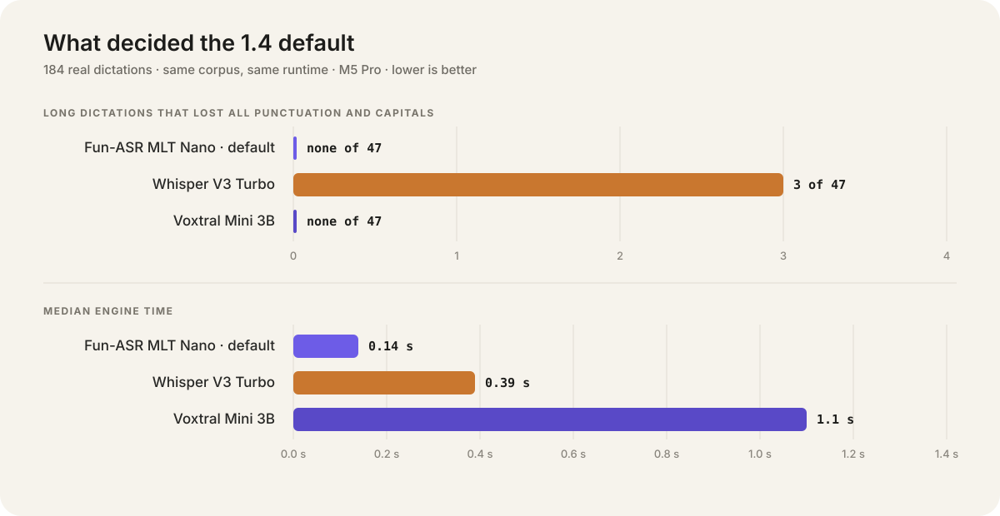
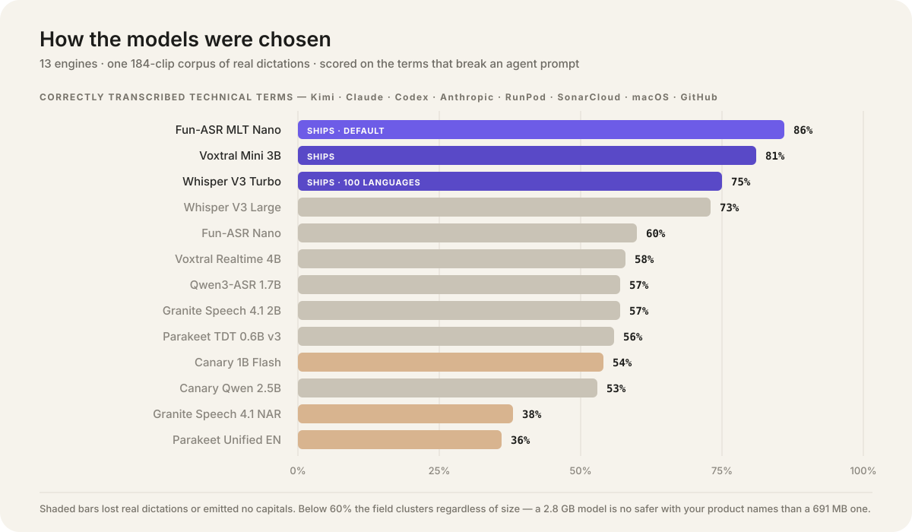
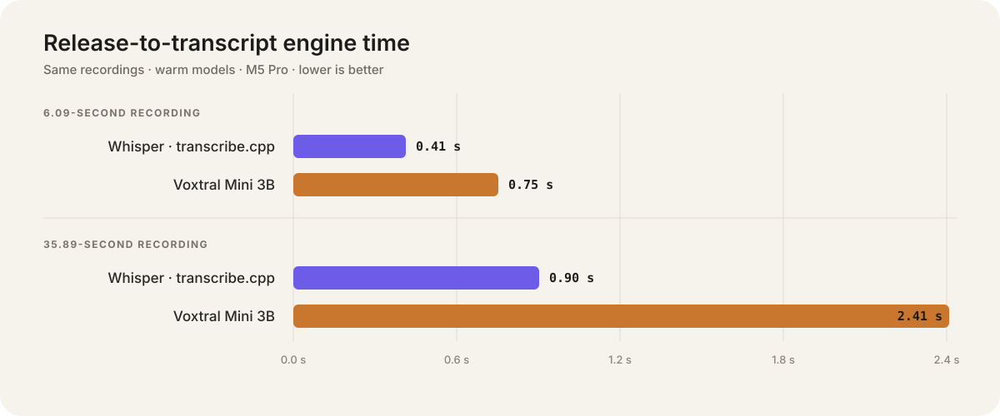

# Pressay benchmark notes

Pressay's defaults came from replaying real voice prompts, not from synthetic one-line demos. This page records the evidence that can be published without exposing anyone's voice or prompt history.

The sanitized aggregate data behind the charts lives in [`docs/benchmarks/results.json`](benchmarks/results.json). Raw audio, transcripts, and per-clip output remain private and are intentionally ignored by Git.

## Test environment

| Item | Value |
| --- | --- |
| Machine | Apple Silicon M5 Pro development Mac |
| OS / toolchain | macOS 26, Swift 6.2 |
| Corpus | 184 real hold-to-talk dictations |
| Audio duration | 0.54–103.59 seconds; 36.33 minutes total |
| Content | AI-agent prompts, team messages, technical identifiers, names, numbers, and multi-part tasks |
| Timing | Warm model; wall-clock inference time; one engine at a time |

The corpus is representative of the app's intended use, but it is not a standardized public benchmark. Results should be treated as product calibration on one machine, not universal model rankings.

## Pressay 1.4 — thirteen-engine sweep

For 1.4 every engine in `transcribe.cpp` that plausibly beat Whisper was replayed through the same
184-clip corpus. Three passes were needed, because two of the candidates are misleading at their
defaults:

1. **Defaults.** Fun-ASR and Granite emit no punctuation at all — they ship PNC/ITN off and Pressay
   never asked for them. Fun-ASR scored 8/46 collapsed long clips this way.
2. **PNC/ITN requested** where the model advertises the toggle. Fun-ASR went to 0/46.
3. **English-locked** for the Fun-ASR variants, which removed the foreign-language hallucinations
   auto-detect produced on near-silent clips.

<p align="center">
  
</p>

Final numbers, best configuration per engine, sorted by the metric that decided it:

| Engine | Size | Terms | Collapse | Complete | Lost | punct/caps | Median |
| --- | ---: | ---: | ---: | ---: | ---: | --- | ---: |
| **Fun-ASR MLT Nano** *(ships, default)* | 691 MB | **86%** | **0/47** | 97.6% | 0 | .049/.090 | **0.14 s** |
| **Voxtral Mini 3B** *(ships)* | 2.98 GB | 81% | **0/47** | 97.5% | 0 | **.069/.099** | 1.28 s |
| **Whisper V3 Turbo** *(ships)* | 886 MB | 75% | 3/47 | 96.1% | 0 | .056/.080 | 0.39 s |
| Whisper Large V3 (full) | 1.67 GB | 73% | 3/47 | 96.1% | 0 | .055/.085 | 0.60 s |
| Fun-ASR Nano | 850 MB | 60% | 1/47 | 96.9% | 0 | .049/.088 | 0.15 s |
| Voxtral Mini 4B Realtime | 2.83 GB | 58% | 0/47 | 96.1% | 0 | **.073/.104** | 1.57 s |
| Qwen3-ASR 1.7B | 2.19 GB | 57% | 0/47 | **98.0%** | 0 | .063/.102 | 0.44 s |
| Granite Speech 4.1 2B | 2.56 GB | 57% | 0/47 | 97.0% | 0 | .046/.083 | 0.30 s |
| Parakeet TDT 0.6B v3 | 1.30 GB | 56% | 0/47 | **99.2%** | 0 | .058/.099 | **0.06 s** |
| Canary 1B Flash | 1.05 GB | 54% | 0/47 | **93.8%** | **4** | .046/.080 | 0.10 s |
| Canary Qwen 2.5B | 2.80 GB | 53% | 0/47 | 97.1% | 0 | .037/.082 | 0.30 s |
| Granite Speech 4.1 NAR | 2.50 GB | 38% | 0/47 | 95.5% | 2 | .056/**.000** | 0.18 s |
| Parakeet Unified EN | 731 MB | **36%** | 0/47 | 98.0% | 0 | .037/.085 | 0.06 s |

<p align="center">
  
</p>

Metric definitions:

- **Collapse** — dictations over 15 s that came back with *exactly* zero terminal punctuation and
  zero capitals across 25+ words. The corpus breaks cleanly here: the affected clips sit at
  0.000/0.000 and the next-worst is 0.013/0.065.
- **Terms** — canonical spellings as a share of all renderings, for `Kimi`, `Claude`, `Codex`,
  `Anthropic`, `RunPod`, `SonarCloud`, `macOS` and `GitHub`, scored against the wrong renderings
  actually observed (`Akimi`, `Kemi`, `kimimi`, `run pod`, `Rampod`, `entropic`, …).
- **Complete** — words produced against the best engine on the same clip. This catches *silent
  omission*, which no formatting metric sees.
- **Lost** — real dictations (longer than 2.7 s, so not near-silent) dropped to an error.
- **punct/caps** — median per-word density of `.!?` and of capitalized words, on clips over 15 s.

### What decided it

Whisper Large V3 full was tested to check whether the collapse came from Turbo's shallower decoder
(4 blocks against 32). **It did not** — full V3 collapsed on 3/47 as well, on different clips, while
running 1.7× slower. That hypothesis is dead, and the collapse is not a decoder-depth artifact.

**Technical terms decided everything else.** The field splits into three: Fun-ASR, Voxtral and
Whisper at 75–86%, then a cliff to 53–60% for everything newer or larger. Size does not predict it —
a 2.8 GB Canary Qwen scores 53% where a 691 MB Fun-ASR scores 86%. For dictating agent prompts a
wrong repository name costs more than a missing comma, so this ranking dominates.

The models that write the prettiest prose are not the accurate ones. Voxtral Realtime has the best
punctuation and capitalization measured (.073/.104) and Qwen3-ASR the best completeness (98.0%), and
both sit at 57–58% on terms. Parakeet TDT v3 has the best completeness of all (99.2%) at the fastest
speed (0.06 s) — and 56% on terms, which is why 1.3 was right to drop it.

**Whisper also omits words**, not just punctuation: 96.1% completeness with content silently missing
on 4 of 47 long clips, second-worst in the field. In one passage it rendered "That seems like a
creative idea that nobody's done before" as "but it's done before".

Canary 1B Flash dropped four genuine dictations (7.0, 8.5, 10.6 and 16.2 s) and showed real
repetition looping — 8.9% duplicated 6-grams on its worst clip. Granite NAR emits no capital letters
even with PNC requested.

**Voxtral Mini 4B Realtime** (Apache-2.0, Feb 2026) was evaluated as a possible replacement: it has
no practical length limit, which would remove the chunking below. In batch it is the *slowest*
engine here at 1.57 s, because a streaming model has no advantage when the whole clip arrives at
once. Streaming it during the hold would not help either — Fun-ASR's mean wait is 259 ms and only
2.2% of dictations exceed one second, while Voxtral Realtime's committed delay alone is 480 ms.

An "error" is not automatically a defect. On near-silent 1.2 s clips Whisper returns `"you"`,
`"Thank you."` or `"."`, while Voxtral and (now) Fun-ASR return nothing. Inserting nothing is the
correct behaviour; those rows are counted as empties, not failures.

### Limitations

- The manifest's `rawTranscript` is the **production Whisper output, not a reference**, so there is
  no hand-corrected ground truth here and **no true WER is reported**. Vocabulary is a substring
  proxy, not a critical-token error rate.
- The collapse definition is stricter than the 1.3 note's "7 of 47"; it reads Whisper Turbo at 3/47.
  The same detector is applied to every engine, so the comparison holds even though the absolute
  number differs from the earlier note.
- One repetition, one machine, one speaker, English. Latency figures are wall-clock on a warm model.

### Chunking long dictations is a speed win, not just a safety net

Fun-ASR and Voxtral generate a transcript token by token, so decode cost grows with output
length. Whisper does not — it chunks inside the runtime — and the curves cross:

| Clip length | Fun-ASR | Whisper | Voxtral |
| --- | ---: | ---: | ---: |
| 0–5 s | **0.08 s** | 0.43 s | 0.93 s |
| 5–15 s | **0.20 s** | 0.43 s | 1.13 s |
| 15–30 s | **0.43 s** | 0.48 s | 1.70 s |
| 30–60 s | **0.96 s** | 1.01 s | 3.42 s |
| 60 s+ | 2.94 s | **1.56 s** | 6.08 s |

So splitting long audio is worth doing even when the decoder could hold it. Thresholds were
swept over the 18 clips longer than 30 s:

| Split at | Total | Median | Worst case |
| --- | ---: | ---: | ---: |
| never | 16.89 s | 0.76 s | 3.68 s |
| **60 s** | **15.32 s** | 0.76 s | **1.95 s** |
| 40 s | 15.88 s | 0.78 s | 2.12 s |
| 30 s | 16.98 s | 0.84 s | 2.13 s |
| 20 s | 19.45 s | 0.98 s | 2.46 s |

60 s is a measured optimum, not a guess: below ~40 s the per-call overhead makes long dictations
*slower*. Quality is unaffected — technical terms 78% either way, punctuation .053 against .052,
transcripts 99.3% identical on average. Across the whole corpus the worst-case wait fell from
4.71 s to 2.07 s for Fun-ASR and from 13.27 s to 6.34 s for Voxtral.

Two bounds are checked, and the lower wins: what the decoder context can hold (reported by the
runtime) and where splitting starts paying for itself (declared per model). The reactive retry on
`outputTruncated` stays, because truncation is not purely a length problem — a repetition loop
exhausted the context on a 2.6 s clip.

There is no setting that avoids this. `transcribe_session_params::n_ctx` can only *lower* the
decoder context (`min(n_ctx, model_max_ctx)`, default 0 = model maximum), and
`TRANSCRIBE_FEATURE_LONG_FORM` is whisper-only.

### Quantization: Q6_K is the ceiling, not a compromise

The default ships at Q6_K (691 MB). Both larger quants were replayed through the same corpus:

| Quant | Size | Terms | punct/caps | Collapse | Median |
| --- | ---: | ---: | --- | ---: | ---: |
| **Q6_K** *(ships)* | **691 MB** | **86%** | .049/.090 | 0/47 | **0.14 s** |
| Q8_0 | 891 MB | 81% | .049/.097 | 0/47 | 0.15 s |
| BF16 | 1590 MB | 81% | .049/.097 | 0/47 | 0.19 s |

Q8_0 and BF16 are the same model in practice — identical output on 93% of clips and identical on
every aggregate metric — so the extra 700 MB buys nothing at all. Against Q6_K they differ on ~3% of
words with **no systematic winner**: Q6_K is marginally ahead on technical terms, Q8_0 on
capitalization, both inside noise. There is no quality headroom left to purchase here.

## Pressay 1.3 — Voxtral evaluation

For 1.3 we evaluated **Voxtral Mini 3B (Q4_K_M)** — an LLM-style multilingual audio model — against the shipping Whisper V3 Turbo, replaying the same 184-clip corpus through the `transcribe.cpp` engine. Parakeet was dropped in this release (quality not comparable to Whisper), so the shipped choice is Whisper (default) with Voxtral as an opt-in.

### Latency and memory

<p align="center">
  
</p>

| Engine | 6.09 s clip | 35.89 s clip | Corpus median | Peak RAM |
| --- | ---: | ---: | ---: | ---: |
| Whisper V3 Turbo Q8 | 0.41 s | 0.90 s | 0.42 s | ~1.15 GB |
| Voxtral Mini 3B Q4_K_M | 0.75 s | 2.41 s | 0.75 s | ~4.8 GB |

Voxtral is roughly 2× slower and needs about 4× the memory (and a ~3 GB download vs ~0.9 GB). Both stay well under a second on typical clips. Higher-precision Voxtral quants (Q8 ≈ 7 GB RAM, BF16 ≈ 10 GB) were not pursued: the extra memory is unreasonable for a background dictation utility, and the failure modes below are behavioral, not precision-related.

### Quality

The corpus splits cleanly by clip length. Short clips (≤ 15 s) are **44% of clips but only ~34% of dictated words**; long clips (> 15 s) are 26% of clips but **~66% of dictated words**.

- **Short clips (≤ 15 s): effectively tied.** Both engines produce good output. Voxtral is slightly *worse* on the very shortest (≤ 2 s): 7 clips returned empty and 1 emitted an assistant-style refusal. Whisper handled those.
- **Long clips (> 15 s): Voxtral clearly better.** It keeps punctuation, capitalization, and completeness where Whisper intermittently collapses into an unpunctuated lowercase block — Whisper fully collapsed on **7 of 47** clips over 15 s (near-zero capitals and punctuation); Voxtral collapsed on **0**. Voxtral also handled proper nouns better (e.g. "Kimi" vs "Kimmy").

Raw word-for-word accuracy is close on both; the difference is formatting, completeness, and worst-case robustness on long-form dictation.

### Tuning

Voxtral runs greedy decoding and exposes only a `language` lever through the engine (its `pnc`/`itn` toggles are not controllable, and it has no initial-prompt path here). **Automatic language detection is safer than forcing English**: a near-silent clip that fabricated a full sentence under forced-English produced nothing under autodetect, and the 7 short-clip hard-errors became clean empties. Automatic is the app default. Whisper's own knobs were also swept (condition-on-previous-tokens, no-speech threshold, and a vocabulary initial-prompt) — none improved its long-clip collapse, and the prompt was a net negative — so Whisper ships at its defaults.

### Decision

Whisper V3 Turbo remains the default (light, safe on short clips, works on 8 GB Macs). Voxtral Mini is an opt-in for long-form dictation, downloaded on demand with a progress bar; only the selected model is held in memory. The rare Voxtral assistant-refusal on unintelligible short audio is filtered to insert nothing.

## ASR selection

The 1.0 investigation compared the former WhisperKit implementation, Whisper Large V3 Turbo and Parakeet TDT 0.6B v3 through `transcribe.cpp`, and language/worker settings. Candidate transcripts were reviewed for meaning, identifiers, numbers, negations, and obvious hallucinations.

### Shared-clip latency

The values below come from exactly the same two recordings for all three engines.

| Engine | 6.09 s clip | 35.89 s clip | Role in 1.0 |
| --- | ---: | ---: | --- |
| Parakeet TDT 0.6B v3 F16 | 0.057 s | 0.215 s | Optional fastest model |
| Whisper V3 Turbo Q8 via `transcribe.cpp` | 0.327 s | 0.765 s | Default |
| Whisper V3 Turbo via previous WhisperKit path | 0.566 s | 1.569 s | Retired implementation |

These samples show why the native GGUF path replaced WhisperKit for 1.0. Parakeet is dramatically faster, especially on long audio, but it was less reliable on very short fragments in the development corpus. Because transcript quality is the primary goal, Whisper V3 Turbo remains the default.

### Worker and language sweep

The previous WhisperKit implementation was replayed across the complete 184-clip corpus twice per worker setting:

| Configuration | Median inference time |
| --- | ---: |
| 1 worker | 0.564 s |
| 4 workers | 0.561 s |
| 16 workers | 0.561 s |
| 4 workers, automatic language detection | 0.600 s |

More workers did not materially improve the median. Automatic language detection added a small pass and could misclassify short clips, which is why Pressay keeps fixed-language selection available even though Automatic is the UI default.

## Post-processing selection

An on-device Foundation Models experiment replayed 31 dictations through four prompt variants. Every output then passed through the same protected-token validator used during development. An accepted output retained the required technical tokens, numbers, URLs, names, and negations.

| Variant | Accepted | Pass rate | Median latency |
| --- | ---: | ---: | ---: |
| Light + few-shot | 29 / 31 | 93.5% | 0.811 s |
| Light | 27 / 31 | 87.1% | 0.762 s |
| Shipping experiment | 21 / 31 | 67.7% | 0.813 s |
| Light, plain instructions | 8 / 31 | 25.8% | 0.824 s |

The validator is intentionally conservative. It does not measure whether prose sounds nicer; it answers the more important standard-dictation question: “Did the rewrite preserve protected meaning?” No tested generative variant was perfect, so Pressay 1.0 removed automatic LLM rewriting from its normal path.

The shipping design is:

1. Use deterministic cleanup for every standard dictation.
2. Apply curated and learned vocabulary rules without asking a model to reinterpret the sentence.
3. Keep the optional Structured Dictation pass deterministic too — punctuation, paragraphs, and lists, never a rewrite.

## Structuring bake-off

Before Structured Dictation shipped, `PressayBench structure` replayed a 438-clip private corpus through two candidates: the deterministic `TranscriptStructurer` rules and a formatting-only on-device Foundation Models prompt (words must be preserved verbatim; only punctuation, paragraphs, and bullets may change).

| Candidate | Clips changed | Fabricated words | Dropped words | Errors | Median latency |
| --- | ---: | ---: | ---: | ---: | ---: |
| Rules | 93 / 438 | 0 | 0 | 0 | 0 ms |
| On-device LLM | 26 / 438 | 7 clips | 9 clips | 7 (guardrail/decoding) | 582 ms |

Even under a strictly formatting-scoped prompt, the language model completed a truncated dictation with invented words ("Maybe we could also talk about the" → "…the response in the next meeting."), silently dropped words on nine clips, and refused seven benign clips outright — while structuring fewer clips than the rules. That settled the choice: Structured Dictation is rule-based, and a fine-tuned local model was not pursued because it would have to beat a zero-defect, zero-latency baseline at its own game.

## Vocabulary tuner precision

`PressayBench tune-eval` replayed 680 transcripts (997 candidate terms) through the legacy and fixed deterministic matchers, with hand labels over every proposed rule:

| Variant | Proposed rules | Precision |
| --- | ---: | ---: |
| Legacy matcher | 20 | 94% (learned `codebase → Codex`) |
| Fixed matcher | 15 | 100% |

The fixed matcher (larger English stop list, minimum phonetic key length 4, recurrence scaled to phonetic distance) kept every genuinely useful rule — including `CloudMD → CLAUDE.md` and `codecs → Codex` — while rejecting the ordinary-word rewrites the legacy matcher had learned on real machines (`mix → macOS`, `correction → Markdown`, `colleagues → Codex`).

A frontier-LLM replay of the judge prompt over the same 997 candidates confirmed the two-tier design: the LLM contributed real rules the deterministic tier structurally cannot act on — ambiguity ties (`CloudCode` is phonetic distance 1 to both `Claude Code` and `CLAUDE.md`), too-short keys (`TLDA → TL;DR`), and distance-2 variants (`Sona Cloud`, `SornCloud`, `Sunr cloud → SonarCloud`) — while the anchor filter discarded 149 of its 184 raw findings as junk. The judgment tier earns its keep, but only behind that filter.

## Reproducing the harness

`PressayBench` is included in the Swift package. Create your own local manifest rather than committing recordings:

```bash
swift run PressayBench manifest-from-audio \
  --manifest /absolute/path/manifest.json

swift run PressayBench asr \
  --manifest /absolute/path/manifest.json

swift run PressayBench structure \
  --manifest /absolute/path/manifest.json
```

The manifest schema is represented by `ManifestEntry` in [`Sources/PressayBench/Bench.swift`](../Sources/PressayBench/Bench.swift). Keep paths absolute, use the same clips for every engine, warm each model before timing, and manually correct reference transcripts before calculating error rates.

## What the numbers do not prove

- The private corpus cannot provide independently reproducible WER.
- Two shared clips are enough to demonstrate relative latency on the development Mac, not quality across accents and environments.
- A validator pass is a safety check, not a blind preference score.
- Cloud-model latency and behavior vary over time, so the repository does not publish a permanent Kimi leaderboard.

If public contributors provide a consented, license-compatible prompt-dictation corpus, Pressay can add normalized WER and critical-token error rates without weakening the current privacy standard.
